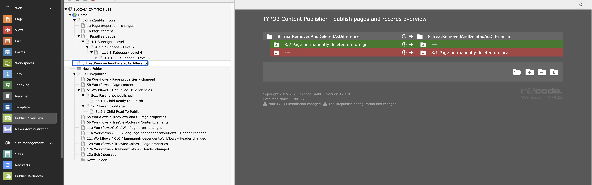

# Feature: HideRecordsDeletedDifferently

By default, records that have been soft-deleted are ignored by the publisher.

However, it may be useful to show records that have been permanently removed on one side (e.g. by EXT:recycler), but are
still present with a deleted flag on the other side (soft-deleted).

If this feature is disabled, these records are shown as difference view in the OverviewModule as shown in the
screenshot.

