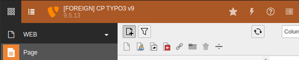

# Feature: Warning On Live

Sometimes admins and also editors log into the foreign backend. They are doing it for various legitimate reasons,
but sometimes they forget they are on foreign, where content should not be edited.

## Colorize Header

To prevent content being created on foreign a new feature was introduced.
The "Warning On Live" feature can, as of in2publish_core 8.5.0, colorize the backend status bar with a custom color.
The status bar color should indicate that the system is Foreign.

* You can enable this feature by setting `features.warningOnForeign.colorizeHeader.enable = TRUE` in your **
  ForeignConfiguration.yaml on Foreign**.
* The color can be changed with the setting `features.warningOnForeign.colorizeHeader.color`.
* Allowed values for `color` are generally speaking all color-ish values accepted by the css option `background-color`
  which represent a color. E.g. Hex values like `#aaa` or `#ab6f8s`, RGB/A `rgb(255, 0, 0)`
  or `rgba(156, 153, 12, 0.42)` or color names like `red`, `blue` or `black`.
* You can find a full list of allowed color names in the
  property `\In2code\In2publishCore\Features\WarningOnForeign\Config\Validator\CssColorValueValidator::$colorNames`

Additional ways of warning editors might be implemented in the future. They will be documented here.
