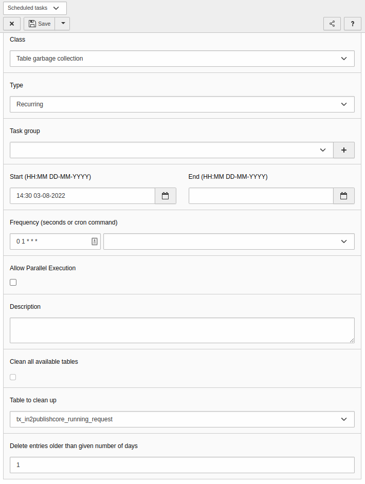

# Installation

## Install the Content Publisher

We recommend [composer](https://getcomposer.org/) to manage your TYPO3 and extensions.

The installation requires the following steps on both the "Local" and "Foreign" system:

1. Install the extension in TYPO3
    * With Composer, the Extension Manager, or a copy of the git repository
2. Create a configuration file on "Local". The default location for the Content Publisher config file
   is `CONF:in2publish_core/`. In composer mode, that path is the folder `config/in2publish_core` next to your
   composer.json. In non-composer mode it is next to the frontend index.php file.
3. Make sure the environment variable `IN2PUBLISH_CONTEXT` is set, otherwise the extension modules are not visible
    * See [Preparation](1_Preparation.md)

> Please make sure that the configuration file is not publicly accessible,
> e.g. https://example.com/config/in2publish_core/LocalConfiguration.yaml

## Set up the Content Publisher

The Content Publisher requires scheduler tasks to run properly. Please head to your "Local" Backend and create a new
scheduler task with class "Table garbage collector" and table `tx_in2publishcore_running_request` which runs once a day.

## New modules on Local

\
_Publisher Overview Module_

\
_Publisher Redirects Module_

\
_Publisher Files Module_

\
_Publisher Tools Module_

If the environment configuration is correct, then you will see these four new backend modules on the "Local" system,
based on your version of the Content Publisher.

In the TYPO3 backend on "Foreign", you won't see any Content Publisher modules, because everything is done on "Local".

---

**Continue with [Configuration](3_Configuration.md)**
