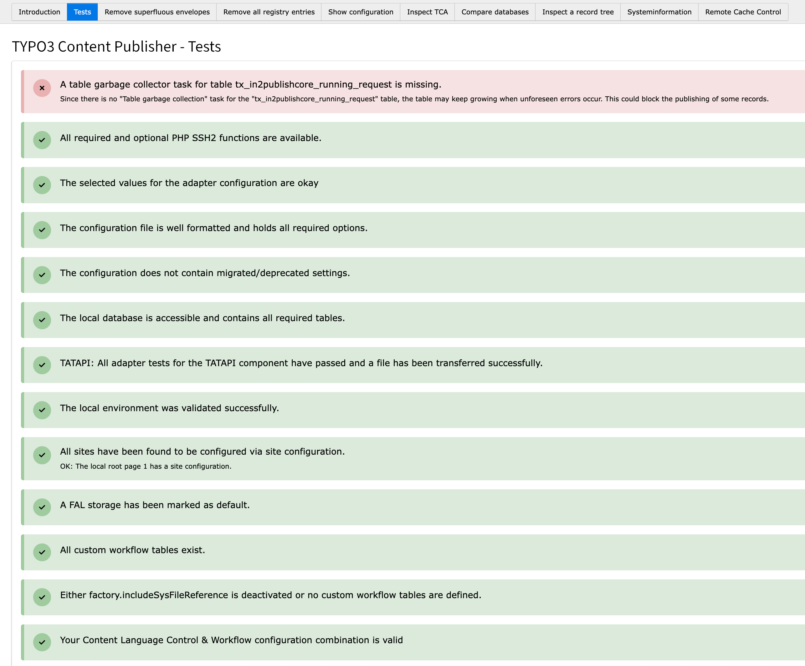

# Testing

## Testing the installation inside TYPO3

After your preparation, installation and configuration of the Content Publisher, you should log in to the backend of your Local
TYPO3.
Open the backend module **Publisher Tools** and select Tests from the drop down.

You should see a couple of test result containers for the configuration and setup tests of the Content Publisher.
Please follow the instructions in order to fix any problems that are detected.

E.g. if you have not created the required [Garbage Collector Scheduler Task](2_Installation.md#garbage-collector-task), you will see a red notice

Hint:

> Please note that the container with **SSH2 Functions** could be red, because you do not have a recent copy of the ssh2
> library for PHP.
> That means that in2publish cannot set permissions for new files and folders on Foreign. If you are using the Foreign's
> webprocess user, you do not have to fear any problems. If you are using a different user, you must keep track of
> the permissions by yourself, using ACLs or something like that.

Hint:

> Some tests will be executed in the background from time to time.
> If a problem is detected, a notice will be shown in the other modules, indicating that the test have to be run.

**You have finished. Enjoy the content publisher!**
