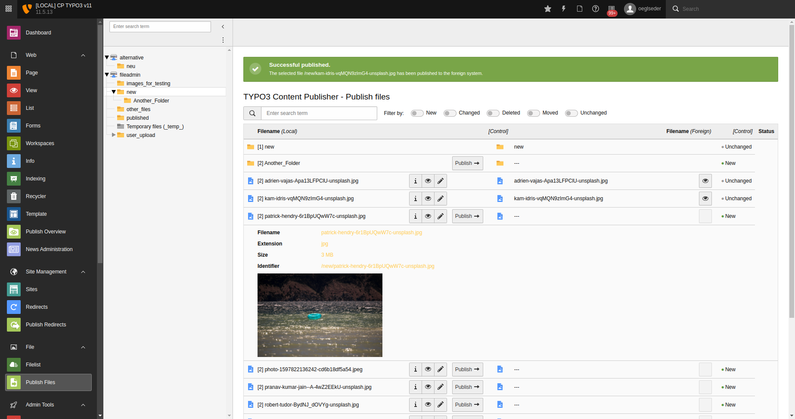
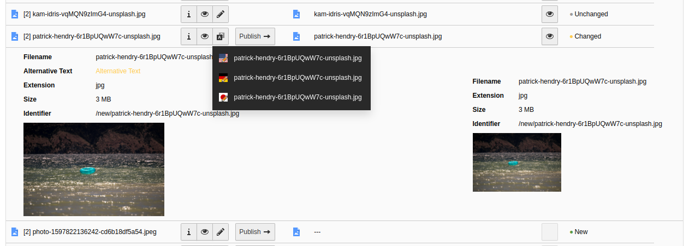
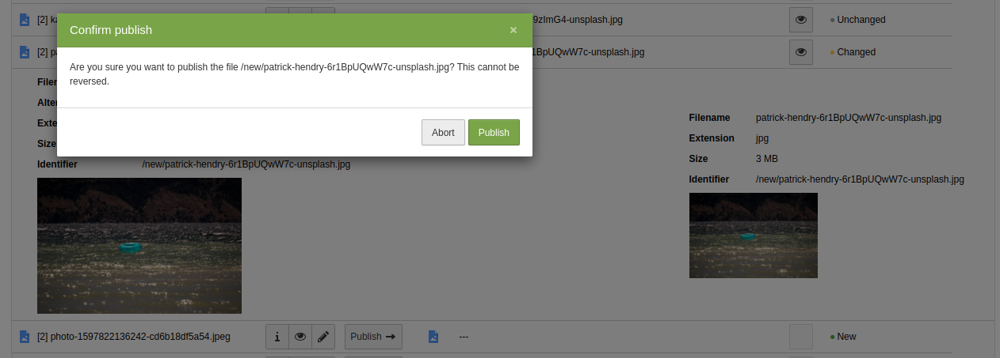
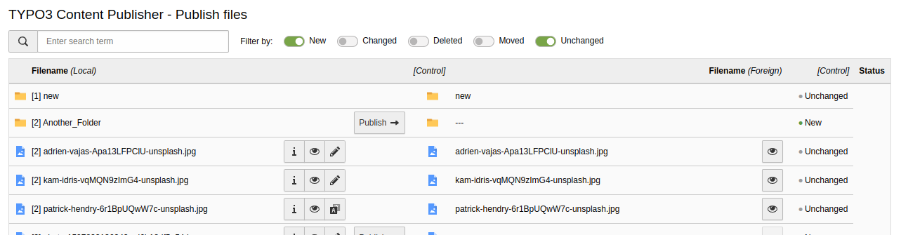
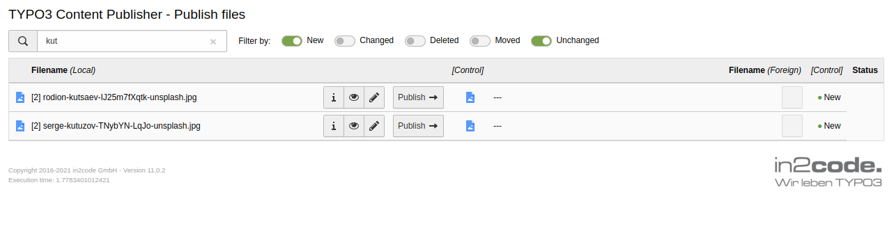

# Publish Files Module

## Screenshots

*Publish Files Overview: A full Screenshot of the TYPO3 Backend with the Publish Files Module and a typical folder. We
added a preview for the image and highlighting for changed properties. The eye button  opens the file in a new tab.*

*You can directly edit the file's metadata via the edit button  in the Publish
Files Module. When there are translations of the file metadata, you can select the language you want to edit in the
dropdown after clicking the edit button . Property changes are highlighten in
yellow.*

*To seamlessly integrate into the TYPO3 Backend, we are using TYPO3's modals for user confirmations.*

*You can easily filter files and folders in the list by their status. The filter selection is saved and applied the next time you open the module automatically.*

*You can also filter files and folders by their name.*
