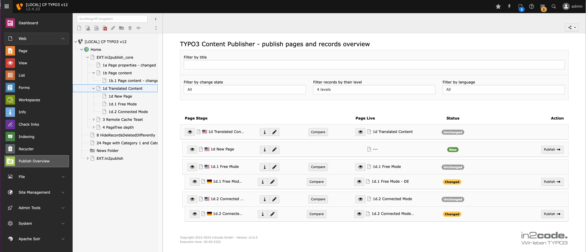
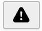

# Publish Overview Module

Opening the **Publish Overview** module allows editors and administrators see live changes between the stage and
production system.
There is a single page tree that compares records on both servers.

The module has been completely redesigned in version 12.6.0 with improved layout, enhanced language filtering capabilities, and better user experience.

## Color Coding

* Grey: The page or a record on this page does not differ between stage and production
* Yellow: There is a change on this page.
* Green: This is a new page.
* Red: This page was deleted.
* Blue: This page has been moved within the pagetree.

## Filtering

Use the folder buttons on the bottom right of the module to filter the tree.
That is useful, e.g., if you want to see only pages, that have changed.
The settings will be kept in the user session as long as the user is logged in.

### Language Filtering

Since version 12.6.0, you can also filter by language to focus on specific language versions of your content. This is particularly useful for multilingual websites where you want to publish content for specific languages only.

## Compare differences between stage and production

There are different ways to compare differences between stage and production:

### Compare view

Clicking on the **compare**-icon will open a new page with a compare view of the two pages.

If the Enterprise Edition is installed, you can also use the  **Compare pages** module.

### Info view

Clicking on the **info**-icon will show a detailed view about which elements are different on this page.

In this view, you can publish (content) elements on this page individually.

### Preview

You can view the pages of stage or production by clicking on the **preview**-icon.

## Publish

Pages with all their related records / content elements can be published simply by clicking the **publish arrow**.
This triggers that this page on the production system contains the same records as the stage system.

Note:

> The arrow-icon is only shown if
>
> * there are changes, and
> * the user has the right to publish, and
> * if using the enterprise edition and workflows are enabled: if the page has the workflow state "ready to publish".

Note:

> If there is a relation from one record to another record on another page, it gets also published. E.g. a news record
> that has a relation to a content record on another page.

Note:
> if there are reasons, why this page should not be published, a **warning symbol** is shown.

Clicking on the warning symbol will show a message explaining the reason(s) why this page cannot be published.

Example reasons are:
* The parent page in the page tree is not published yet.
* The default language for a translated page is not published yet.
* A page depends on disabled records.
* When using the Enterprise Edition: the page or parent page is not in the state "ready to publish".
