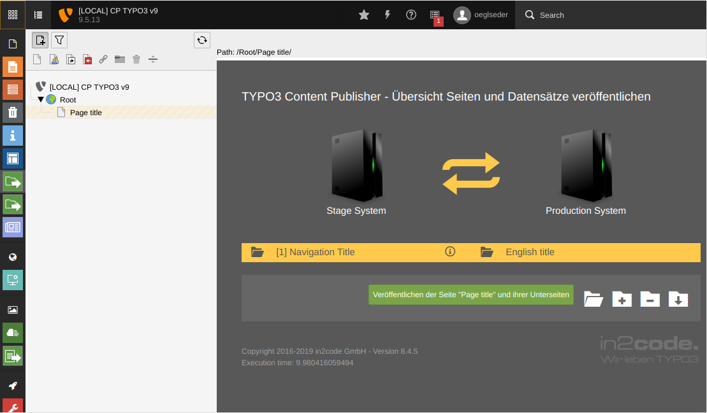

# Alternative Title Field (`view.titleField`)

Allows you to set a different field to use as the title field in the Publish Overview Module.
The Publish Overview Module will show a page's title as record name.
You can change the rendered field by setting a different value for the title field.
The new field must exist in the `pages` table.

```YAML
view:
  titleField: nav_title
```


