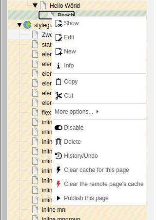

# Feature: Context Menu Publish Entry (`features.contextMenuPublishEntry.enable`)

Adds a new entry to the page tree tight click menu, which allows you to publish the page without opening the publishing module.
Please note, that the option to publish is not restricted to the actual state of the record, because the state calculation requires a lot of resources.
This feature has an integration in the Content Publisher Enterprise Edition, which will hide the context menu entry when the page is not "Ready to publish".

Please read the [Known Issues Documentation](../KnownIssues.md) before activation.
Enable the feature:
```yaml
features:
  contextMenuPublishEntry:
    enable: TRUE
```


