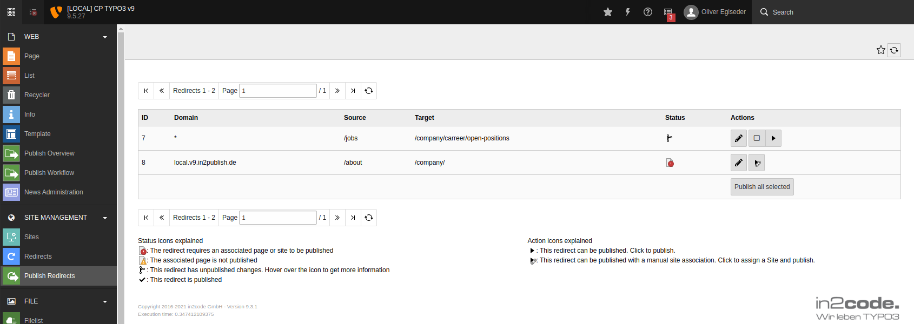

# Redirects Support

TYPO3 has a feature that editors can use to set up and maintain redirects.
This new feature "Redirects Support" is available so that these redirects can also be published.
If the support of the redirects is activated, a new module appears in the backend and two new fields for the redirects themselves.
With the module, specific redirects can be published individually or selected together.

Forwardings are created and maintained on the local system with the local domain. In order for these to work on the remote system, the content publisher must know the name of the corresponding domain on the remote system. This association is either set directly on the site configuration of the remote system or on a page in the local page tree.
If a page has been selected, the forwarding will be published together with the page.

When a redirect is associated with a page, the page must be published so that the content publisher can determine the domain on the remote system.

If forwarding is not restricted to a domain, no site configuration or page association is required.

## Usage

The module shows one row for each redirect. Redirects which are fully published **and** deleted will not be shown,
because they do not have any effect on any instance anymore.

Each row shows the UID, domain restriction, source, target, status and available actions for that redirect.
Each status and action icon is explained below the list. You can also hover over an icon to get more information.

Publishable redirects with changes also have a checkbox. You can select multiple redirects and publish them at once.
The selection is lost when the navigation is used, so you can only publish multiple redirects on a single page.
