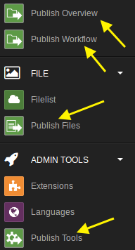

# Extension Installation

The installation boils down to three simple steps on both Local and Foreign:

1. Copy the source code to typo3conf/ext/in2publish (Please see the in2code GitHub tutorial for more details).
2. Activate the Extension via Extension Manager
3. Setup IN2PUBLISH_CONTEXT for the current installation (see [Preparation](1_Preparation.md))
4. Open the in2publish extension configuration (Click on "in2publish_core" in the Extension Manager) and set the path to your **Configuration.yaml** files (see next chapter for details).

## New modules on local

If the environment is configured correctly, you will see three or four **new Backend Modules** on Local based on your version of the Content Publisher and its installed expansions.

## New command controllers in scheduler module on foreign

On Foreign there are a couple of new command controllers available.

---

**Continue with [Configuration](3_Configuration.md)**
