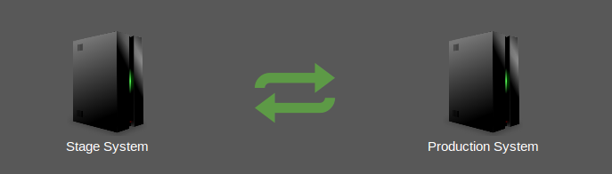
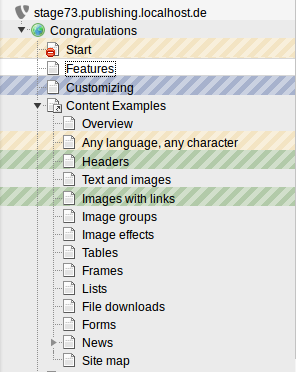
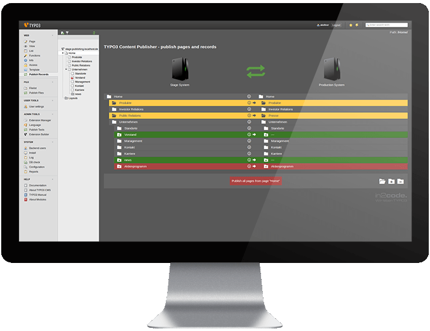
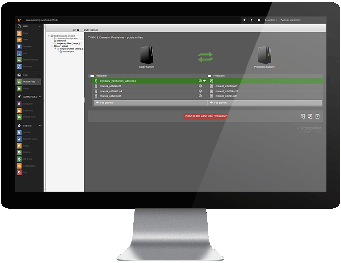
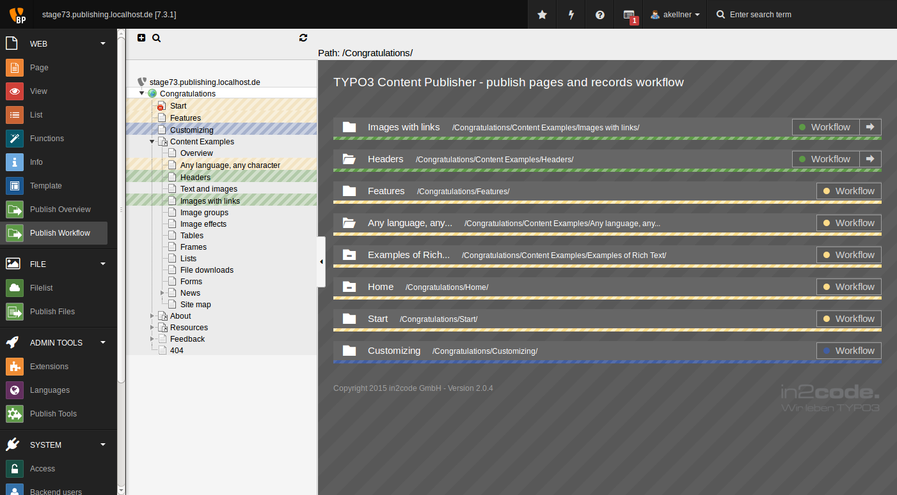
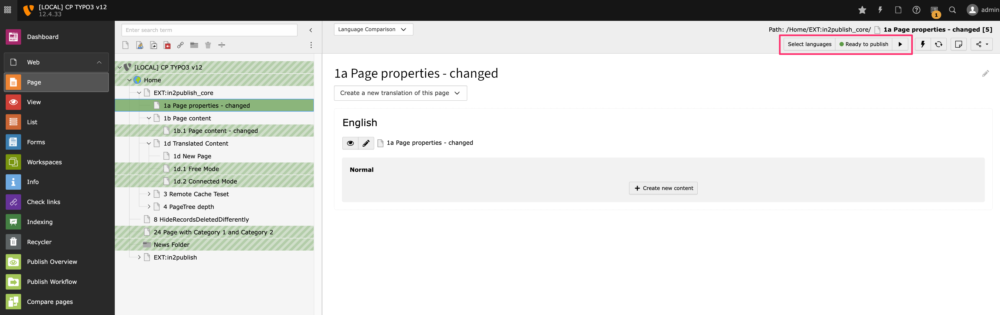
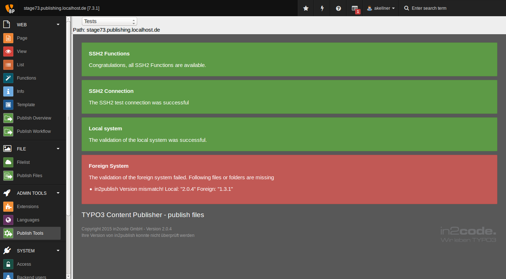

# Introduction

## Start

Publish content from one server to another one, by selecting content.

## Screenshots

### Backend Module - Publish Records

### Backend Module - Publish Files

### Backend Module - Workflow Overview

### Workflow Integration in existing Page Module

### Backend Module - Tools

## What does it do?

Read news about Content Publisher for TYPO3:

* https://contentpublisher.in2code.de/
* https://www.in2code.de/news/ContentPublisher.html

The **Content Publisher for TYPO3** is a Content and File Publishing Tool for TYPO3 CMS, which aims
for easy, intuitive and daily usage focused on editors' daily business.

## Features

* Default
  * Minimal configuration, maximum gain. in2publish is based on the lowest common denominator of TYPO3 CMS and its extensions, the TCA (Table Configuration Array).
  * Page based publishing of pages, content elements and other structures
  * TCA based relation resolving. Any extension which will be installed should work out-of-the-box, as long as it uses common TCA features. Therefore no additional Configuration is neccessary. Configuration options are still provided, described in the Chapter "Configuration". Userfunc in TCA is currently NOT supported.

* Workflow
  * Define as many workflow states as you need.
  * Workflow start automatically as soon as an editor creates, edits or deletes records.
  * Colors in page tree help to identify pages that are in a workflow.

* Security
  * Any connection between servers and databases is secured by SSH2. All internal methods to create such a connection are based on Private/Public keys. Password authentication is not supported intentionally, but the Private Key may be encrypted using a password.
  * Eliminates the need for backend users on the production server.
  * The *production* server is not able to connect to *stage* server.
  * The configuration file can be stored outside of the webroot.

## Environment

in2publish deals with exactly two servers:

* The first one, where editors write content and upload images, is called "local" or "stage".
  The second, where visitors open the Frontend and no BE Login exists, is called "foreign" or "production".
* Any connection between those Servers is controlled by the Local side. Foreign is not able
  to connect itself to Local and send or receive data or commands actively.
