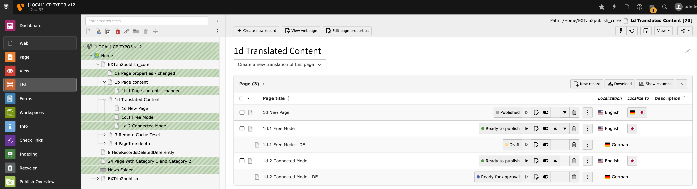

# Introduction

## Start

Publish content from one server to another one, by selecting content.

## Screenshots

### Backend Module - Publish Overview

Module to select and publish pages/content from the local server to the foreign server.

### Backend Module - Publish Files

Module to select and publish files from the local server to the foreign server.

### Backend Module - Publish Redirects

Module to select and publish redirects from the local server to the foreign server.

### Backend Module - Publisher Tools

Module to analyze the current setup, configuration and database content.

### Backend Module - Publish Workflows

Enterprise Edition only: Module to manage and publish workflows for pages, news or any other record type.

### Integration in existing Page Module

Enterprise Edition only: Integration of the workflow states in the TYPO3 Page Module.

### Integration in existing List Module

Enterprise Edition only: Integration of the workflow states in the TYPO3 List Module.

## What does it do?

Read news about Content Publisher for TYPO3:

* https://contentpublisher.in2code.de/
* https://www.in2code.de/news/ContentPublisher.html

The **Content Publisher for TYPO3** is a Content and File Publishing Tool for TYPO3 CMS, which aims
for easy, intuitive and daily usage focused on editors' daily business.

## Features

* Default
    * Minimal configuration, maximum gain. The Content Publisher is based on the lowest common denominator of TYPO3 CMS and its
      extensions, the TCA (Table Configuration Array).
    * Page based publishing of pages, content elements and other records types.
    * TCA based relation resolving. Any extension which will be installed should work out-of-the-box, as long as it uses
      common TCA features. Therefore, no additional Configuration is necessary. Extensive configuration options are still
      provided, described in the chapter "Configuration". Note: Userfuncs in TCA are currently NOT supported.
    * Publishing of redirects in the Publish Redirects Module
    * Publisher Tools Module for analysis of current setup, configuration and content

* Security
    * Any connection between servers and databases is secured by SSH2. All internal methods to create such a connection
      are based on Private/Public keys. Password authentication is not supported intentionally, but the Private Key may
      be encrypted using a password.
    * Eliminates the need for backend users on the production server.
    * The *production* server is not able to connect to *stage* server.
    * The configuration file can be stored outside of the webroot.

* Enterprise Features (EXT:in2publish)
    * Workflows for pages, news or any other record type
    * Multi-Select option for publishing of multiple records
    * Publishing of single records, in the Publish Overview Module or List Module or Page Module
    * Workflow states/labels shown in the page tree
    * Time based publishing of records
    * Publishing notifictions

## Environment

The **Content Publisher for TYPO3** deals with exactly two servers:

* The first one, where editors write content and upload images, is called "local" or "stage".
  The second one, where visitors open the Frontend and no BE Login exists, is called "foreign" or "production".
* These two servers are ideally connected via SSH2, which is used to transfer data and commands.
* Alternatively, we provide adapter packages to support other protocols, e.g. HTTP.
* Any connection between those Servers is controlled by the Local side. Foreign is not able
  to connect itself to Local and send or receive data or commands actively.
