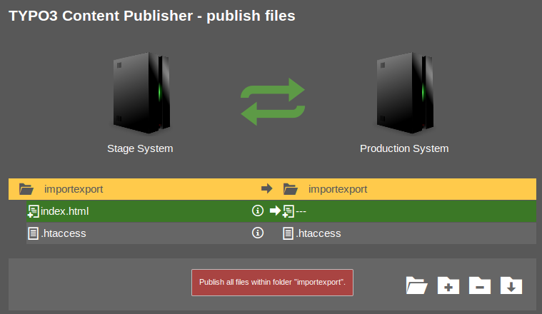

# Publish Files Module

Opening the **Publish Files** module allows editors and administrators to see live changes between the stage and the production system.
There is a single folder structure that compares folders with files on both servers.

 

## Color Coding

* Any color: The page or a record on this page is different on stage and production
* Yellow: There is a change on this page.
* Green: This is a new page.
* Red: This page was deleted.
* Blue: This page has been moved within the pagetree.

## Filtering

Use the folder buttons on the bottom right of the module to filter the structure. 
That is useful, e.g., if you want to see only files that have changed. 
The settings will be kept in the user session as long as the user is logged in.

## See Changes

Clicking on the **i**-icon opens a preview link for this file.

 

## Publish

Files with their related records can be published simply by clicking the arrow icon.
This triggers the transfer of the files and records to the production system.

 

Note:

> The arrow icon is only shown if
> 
> * There are changes, and
> * The user has the right to publish.

Note:

> If there is a relation from the file record to another record, it gets also published.
