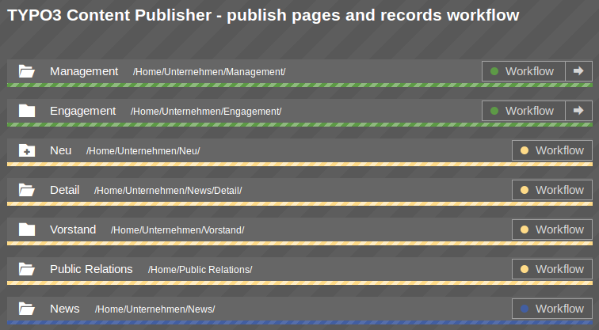
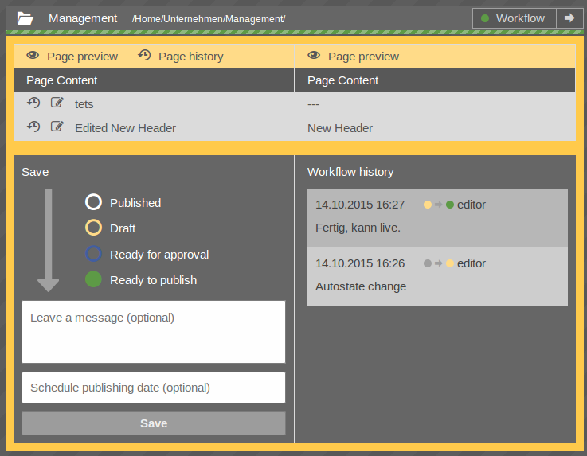

# Publish Workflow module

All pages which are in a workflow can be viewed in a list in the workflow module.

Clicking on the workflow button will open the workflow menu. Clicking on the arrow within the workflow button will publish the page to production system.

Note:

> The arrow icon is only shown if
> 
> * there are changes, and
> * the user has the right to publish, and
> * the page is in workflow state "ready to publish" (or workflow is disabled).

## Workflow menu

 

The workflow menu is separated into three main areas:

* On top: The difference view as described in Publish Overview section above.
* Bottom left: Change the workflow state of the current page.
* Bottom right: See workflow history.

### Change page state

* You can select a new page state (if you are allowed to change this).
* You can leave a message (optional).
* You can enter a date for automatic publishing (if you are allowed to set this).

### Workflow history

See the history of all message back to the moment where the page was published.

**Enjoy publishing!**
