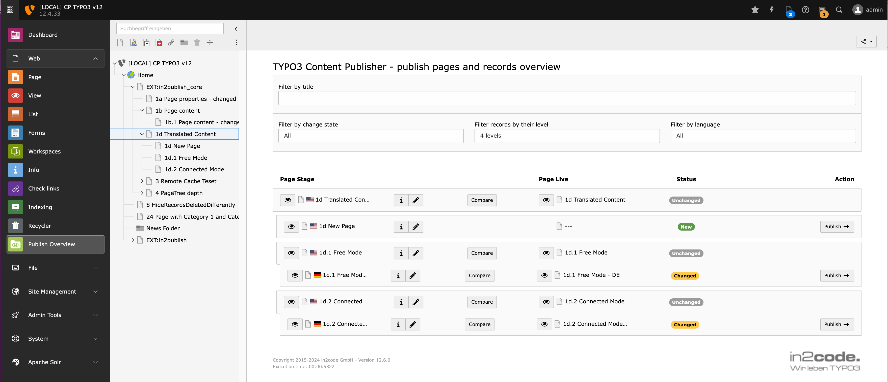
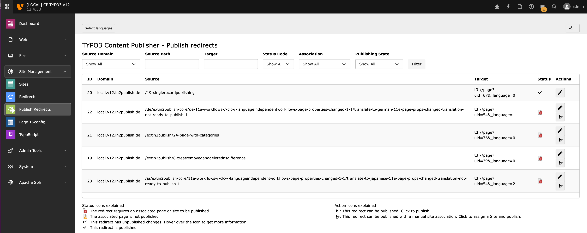
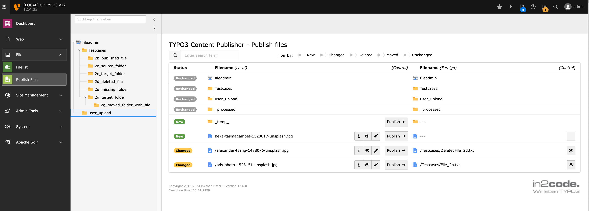
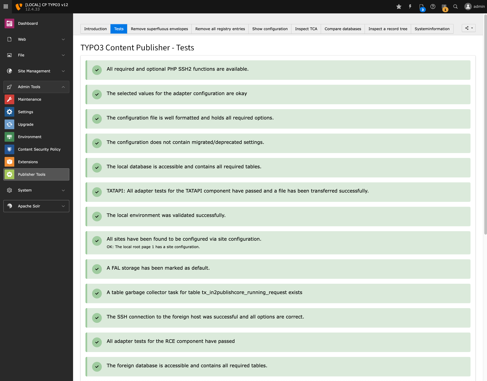
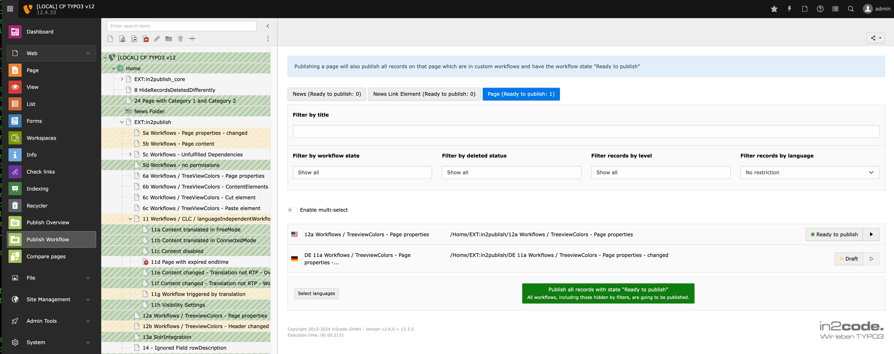
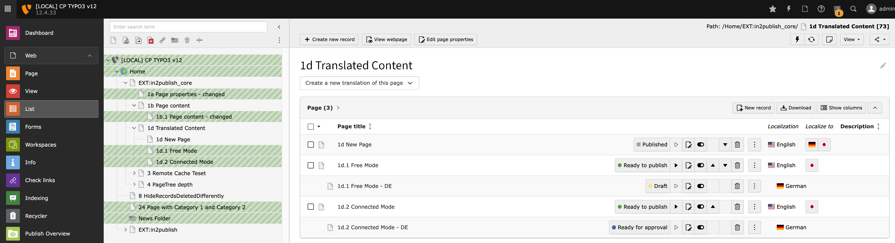
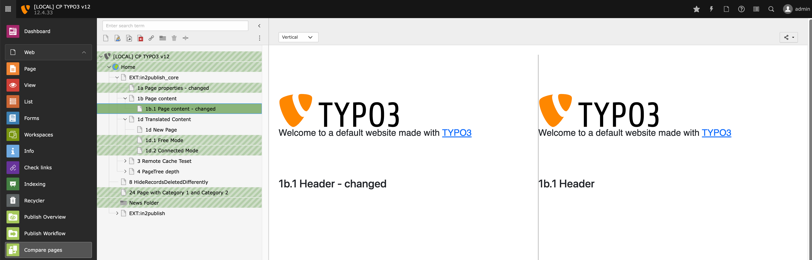

# in2publish_core - Content publisher for TYPO3

## Introduction

Content Publishing in TYPO3 - the easy way:

* Intuitive Use
* High Security
* Future-proof
* Supports all extensions (with correct TCA)

## Support

This TYPO3 Extension is free to use. We as in2code and our developers highly appreciate your feedback and work hard to
improve our extensions. To do so, in2code provides two extra days per month for coding and developing (Coding Night and
Freaky Friday). During these days our more than 20 developers spend their time with improvements and updates for this
and other extensions.

You can support our work by joining the Early Access Program [EAP](https://www.in2code.de/agentur/typo3-extensions/early-access-programm/).
As an EAP member you will receive access to the latest versions many of our extensions before they are publicly released.

Thank you very much in advance.

Your in2code Team

## Description

The Content Publisher for TYPO3 is an extension that allows the separation of TYPO3 into an editorial system and a live
system. This separation allows editors to prepare and test their content independently from the live system. When the
new content is ready to be published, it is transferred to the live system by the Content Publisher with a single click.
Even embedded images and files are reliably transferred. The Content Publisher thus takes working with content to a new
level. Content can be compared with the live system before publication and pages with changes are highlighted in color.

The Content Publisher can transfer entire pages or, in the Enterprise Edition, individual content elements. It is highly
extensible and configurable and supports all TYPO3 features and 3rd party extensions, as long as they provide correct
TCA.

The Enterprise Edition extends the Content Publisher with a large number of features, such as workflows to organize
pages and individual content types in the editing process, workflow assignment, workflow email notification, workflow
colors in the page tree, publishing permissions, limiting publishing to languages, support for Solr, EXT:
fal_securedownload, Remote Cache Control, Multi-Select for publishing and many more.

### Questions

If you have questions **please** have a look at the [FAQs](Documentation/FAQ.md) first. If your question is not listed
try to find your answer in the documentation. You can ask questions (no support!) in the #ext-in2publish Slack channel
on typo3.slack.com but there is no warranty. If you need support you can [contact in2code](https://www.in2code.de/en/).

### Technical note

The content publisher basically requires two TYPO3 instances. A staging and a live instance. Editors work solely on the
stage server. They also have a backend module to manage pages and files and their publishing status. This means that
backend access to the live server is not required anymore. The data transfer between the two servers is secured by
encrypted connections and allows only unidirectional system access from stage to live.

Data from the live server is only transferred upon explicit request from the stage server. This also means that the
stage server can be placed inside the private company intranet while the live server is accessible throughout the
internet. The same TYPO3 extension is installed on both servers. So both servers only differ in configuration. This has
the great advantage that an existing deployment can be used for both systems at once.

See for more details:

* https://www.in2code.de/en/products/typo3-content-publisher/ (english)
* https://www.in2code.de/produkte/typo3-content-publisher/ (german)

### Screenshots

_Publish Overview Module_

_Publish Redirects Module_

_Publish Files Module_

_Publisher Tools Module_

**Enterprise Edition only:**

_Publish Workflow Module_

_Publisher Integration into List Module_

_Publisher Integration into Page Module_

_Compare Pages Module_

## Installation

`composer require in2code/in2publish_core`

Easy installation via composer. See documentation for a step by step manual
* [Installation](Documentation/Admins/Installation/README.md)
* [Requirements And Limitations](Documentation/RequirementsAndLimitations.md)

## Documentation

* [Introduction](Documentation/Introduction.md)
* Extension documentation: [Documentation](Documentation/README.md)
* Community help: https://typo3.slack.com/messages/ext-in2publish/

## Version changelog

See: [Changelog](CHANGELOG.md)

## Testing

There are many unit, functional and acceptance tests which are executed as GitHub Action on every commit.

https://github.com/in2code-de/in2publish_core/actions
